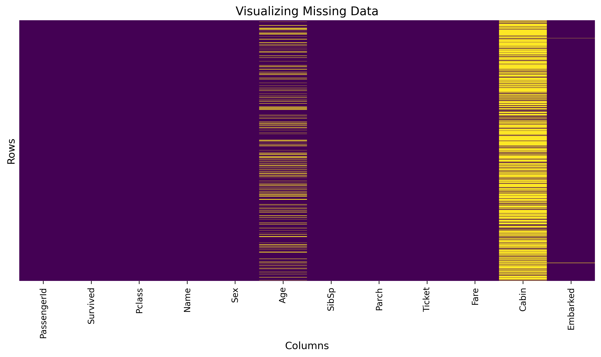
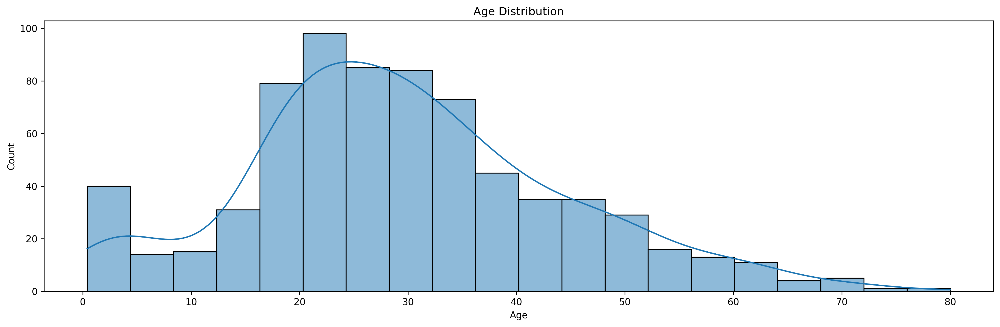
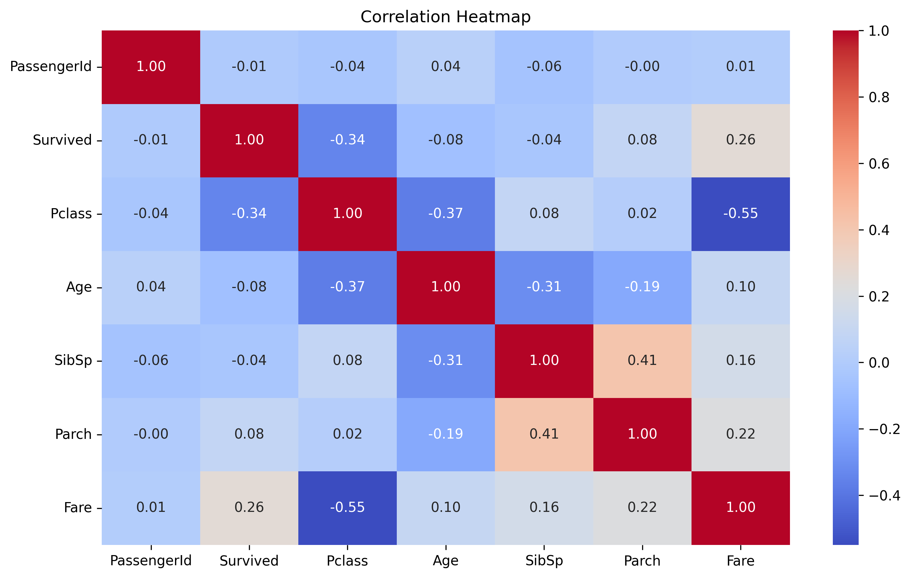
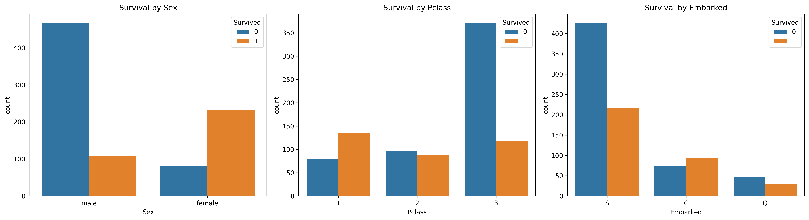
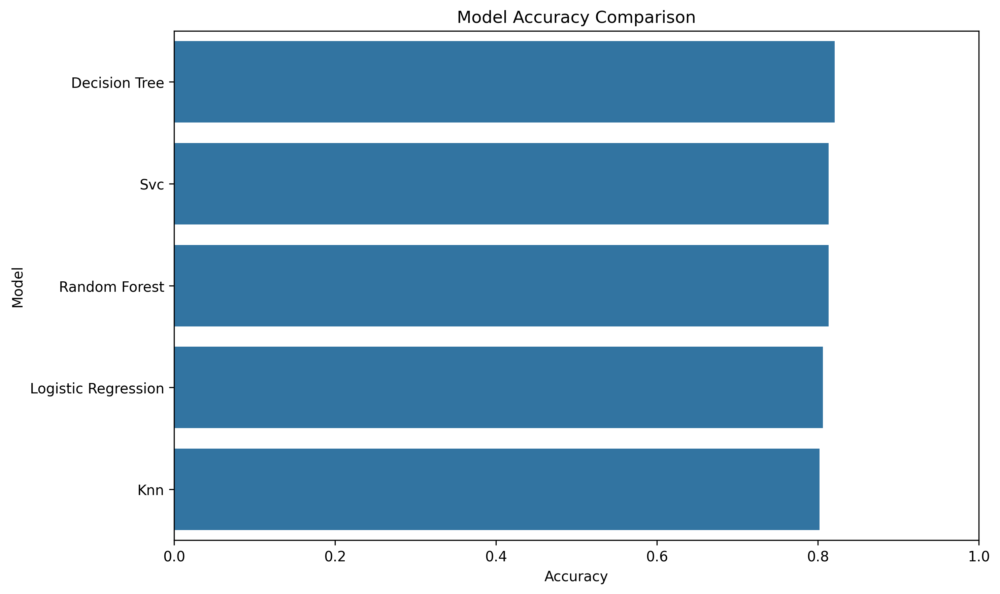

# Titanic Survival Prediction

A Machine Learning project that predicts whether a passenger survived the Titanic disaster.

---

## Project Overview

This project follows a complete Machine Learning workflow:

- Data Loading
- Exploratory Data Analysis (EDA)
- Data Preprocessing
- Feature Engineering
- Model Training
- Hyperparameter Tuning using GridSearchCV
- Model Comparison

---

## Dataset

The project uses the Titanic dataset.

Target variable:

- Survived
    - 0 = Did not survive
    - 1 = Survived

Features include:

- Pclass
- Sex
- Age
- SibSp
- Parch
- Fare
- Embarked

---

## Exploratory Data Analysis

### Missing Values



### Age Distribution



### Correlation Heatmap



### Survival Analysis



---

## Machine Learning Models

The following models were trained:

- Logistic Regression
- Decision Tree
- Random Forest
- Support Vector Classifier (SVC)
- K-Nearest Neighbors (KNN)

Hyperparameter tuning was performed using GridSearchCV.

---

## Model Comparison



---

## Project Structure

```text
Titanic-Survival-Prediction/
│
├── data/
│   └── Titanic_train.csv
│
├── src/
│   ├── Data_Preprocessing.py
│   ├── EDA.py
│   └── buildmodels.py
│
├── notebooks/
│   └── Titanic_Analysis.ipynb
│
├── results/
│   └── figures/
│       ├── missing_values.png
│       ├── age_distribution.png
│       ├── correlation_heatmap.png
│       ├── survival_analysis.png
│       └── model_comparison.png
│
├── requirements.txt
├── README.md
└── .gitignore
```

---

## Technologies Used

- Python
- Pandas
- NumPy
- Matplotlib
- Seaborn
- Scikit-learn
- Jupyter Notebook

---

## Installation

```bash
git clone https://github.com/mariamsayed14/Titanic-Survival-Prediction.git
```

```bash
cd Titanic-Survival-Prediction
```

```bash
pip install -r requirements.txt
```

---

## Usage

Open Jupyter Notebook:

```bash
jupyter notebook
```

Then open:

```text
notebooks/Titanic_Analysis.ipynb
```

---

## Author

**Mariam Sayed**

Computer Science Student  
AI & Data Science Track
